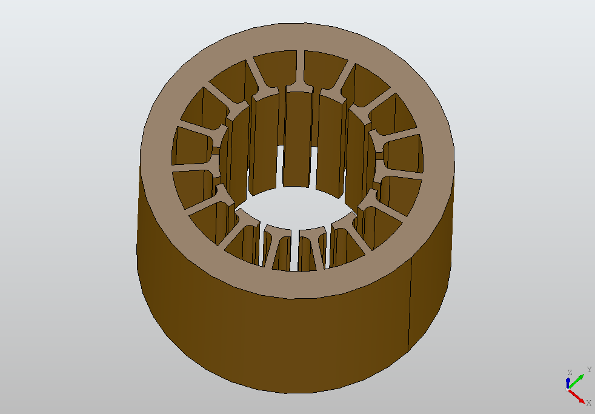

# Electricl Motor Stator 3D Modeller

Thanks to the information and data provided by Dr. Nick Simpson, University of Bristol.

Create 3D stator models using physical parameters.

Note: Only works with Windows.

## Dependencies

1. pythonOCC - https://github.com/tpaviot/pythonocc-core
2. sympy - https://docs.sympy.org/latest/install.html
3. PyQt5 - https://pypi.org/project/PyQt5/

Download the above dependencies following the instructions from the above links.

Go to the root of the folder, then run `python run_gui.py` in your terminal to start the GUI.

## Images

#### GUI

#### Error Messages

#### Inner and Outer Stators

#### Adjusting Number of Stator Teeth

#### Teeth Feet Styles

